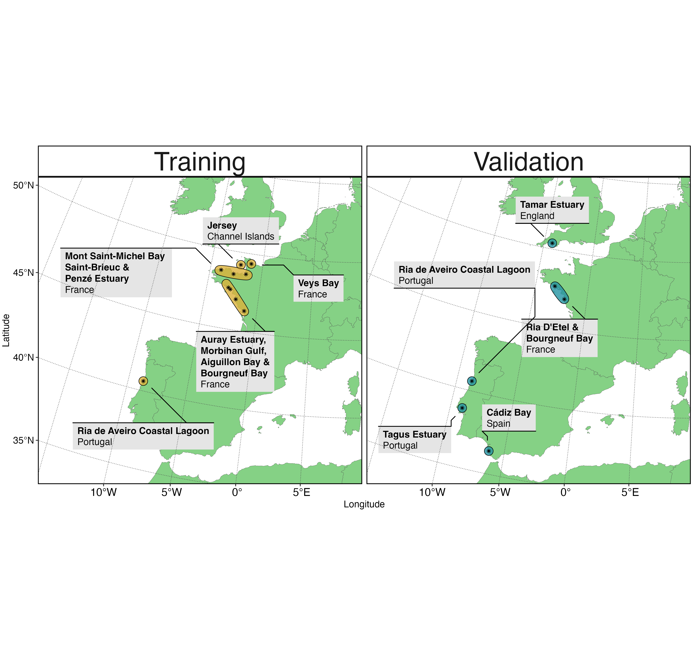

<!-- README.md is generated from README.Rmd. Please edit that file -->

# Intertidal Classification of Europe: Categorising Reflectance of Emerged Areas of Marine vegetation using Sentinel-2 (ICE CREAMS)

Here we present the Neural Network Model produced during the BiCOME
project to identify Intertidal habitats using Sentinel-2. The project
was part of a wider European Space Agency funded work, with three
studies that form part of the European Space Agency’s ‘Biodiversity+
Precursors’ with [Terrestrial
(EO4DIVERSITY)](https://www.eo4diversity.info/), [Freshwater
(BIOMONDO)](https://www.biomondo.info/) and Coastal ecosystems [BiCOME
project](https://bicome.info).

## Environment Set Up (Current)

create a conda environment, activate it and install jupyter lab to view
the notebooks with the following code:

- This installs all the versions of the necessary packages for all the
  notebooks in this repository into a virtual environment called
  ‘ICE_CREAMS’. (As of: 2025-09-01)

``` text
conda create --name ICE_CREAMS conda-forge::fastai=2.8.4 fastcore=1.8.8 geopandas=1.1.1 rioxarray=0.18.1 dask=2025.7.0
```

- activate the environment

``` text
conda activate ICE_CREAMS
```

- install jupyter-lab (this can be skipped if using a different
  GUI/reader)

``` text
conda install jupyterlab

jupyter-lab
```

## Practical Use Order

For any new user it is essential to create a new pickle file as
different operating systems and different fastai versions can create
incompatible pickle files.

Therefore follow these steps fully:

- train the ICE_CREAMS model using the notebook called:
  ‘Train_TabularLearner_NN_S2_ICECREAMS.ipynb’

- export trained model as .pkl file.

- Test this .pkl file against the validation data in
  ‘Apply_ICE_CREAMS_to_Labelled_Validation.ipynb’

- Apply this .pkl file to a Copernicus .SAFE file (with an accompanying
  intertidal mask file that the user must create in the same CRS as the)

## General Contents

This repository contains the scripts to train and apply the ICE CREAMS
model to Sentinel-2 imagery. Sentinel-2 imagery should be downloaded
from any source in the .SAFE format. This model assumes cloud free, low
tide (totally emerged) intertidal areas (currently validated in Europe).

## Published Uses of ICE CREAMS

The ICE CREAMS model has so far been published in relation to Seagrass
Phenology assessments and Seagrass Temporal Patterns in: [Davies *et
al.,* 2024a](https://www.nature.com/articles/s43247-024-01543-z.pdf) and
[Davies *et al.,*
2024b](https://www.sciencedirect.com/science/article/pii/S0034425724003584?via%3Dihub).

## Methods

### Neural Network Inter-Tidal Classifier

#### Training Data

High classification accuracy at Sentinel-2’s spectral resolution has
previously been shown for Class level inter-tidal habitats [Davies *et
al.,*
2023](https://www.sciencedirect.com/science/article/pii/S0034425723001050?dgcid=author),
so data were labelled at the Class level for vegetated habitats
alongside other non-vegetated habitat types. Pixels were labelled into 9
classes: Bare Sand, Bare Mud, Ulvophyceae (green macroalgae),
Magnoliopsida (seagrass), Microphytobenthos (unicellular photosynthetic
eukaryotes and cyanobacteria forming biofilms at the sediments surface
during low tide), Mixed-Rocks with associated Phaeophyceae (brown
macroalgae), Rhodophyceae (red macroalgae), Xanthophyceae (yellow-green
macroalgae) and Water. Due to the heterogeneous nature of inter-tidal
habitats, both spatially and temporally, labelled data need to align
spatially and temporally to available Sentinel-2 imagery. Therefore,
training data were collated across a range of methods to account for
this difference in spatial and temporal variability of habitats. For
classes that show greater variability in their spatial extent over time:
drone imagery derived data were used. For classes that show spatial
fidelity over time: additional data were collected, alongside drone
acquisition, through visual inspection of Sentinel-2 imagery.

##### Drone Acquisition

To adequately cover the expected spectral variability of inter-tidal
habitat classes that occur across the North-East Atlantic coast, drone
imagery was taken from multiple sites in Western Europe (Auray Estuary,
Morbihan Gulf, Bourgneuf Bay and Ria de Aveiro Coastal Lagoon). Drone
imagery were acquired at two different flight altitudes (12 and 120 m)
meaning pixel sizes were either 8 or 80 mm, allowing the classification
of habitats at high spatial resolution. In total these drone images
covered over 4 km$^2$ of inter-tidal habitats.



##### Visual Inspection

To increase the balance between classes, pixels of some classes such as
bare muds and sands, sediments containing high abundances of
microphytobenthos, as well as hard substrates covered by vegetation,
were added to the training dataset. These pixels were selected through
visual inspection of spectral signatures, true colour RGB and false
colour imagery derived from Sentinel-2 accessed and visualised through
the Copernicus data portal.

##### Alignment of Habitat and Sentinel-2 Imagery

All labelled data were aggregated (majority class) to the 10 m
resolution of Sentinel-2, then all Level-2A Sentinel-2 A/B images that
coincided spatially and temporally (+/- 15 days) with these labelled
were downloaded from the Copernicus data portal. Level-2A data have
already been atmospherically corrected using the Sen2Cor processing
algorithm, and are distributed as bottom-of-atmosphere (BOA)
reflectance. Manual inspection of RGB true colour was used to select
cloud free and low tide Sentinel-2 images to remove any unusable images.

##### Pre-Processing

All 12 bands of Sentinel-2 were resampled to 10 m resolution, and
standardised following a Min-Max Standardisation. Furthermore,
Normalised Difference Vegetation Index (NDVI) and Normalised Difference
Water Index (NDWI) were calculated for each pixel from the BOA
Sentinel-2 reflectance values:

$$NDVI=\frac{R(832)-R(664)}{R(832)+R(664)}$$

$$NDWI=\frac{R(560)-R(832)}{R(560)+R(832)}$$

with $R(560)$, $R(664)$ and $R(832)$ being the green (Sentinel-2 band
centred on 560 nm), red (Sentinel-2 band centred on 664 nm) and
near-infrared (Sentinel-2 band centred on 832 nm) spectral domains
respectively. Within the Magniolopsida class, there is a maximum
diversity of three species *Nanozostera noltei*, *Zostera marina* and
*Cymodocea nodosa*, although *Nanozostera noltei* was the dominant
species across most inter-tidal sites assessed. This created a labelled
tabular dataset of 338,526 rows with classes in one column, and features
in 26 others: 12 BOA reflectance columns, 12 Min-Max standardised
reflectance columns, and 2 columns for NDVI and NDWI.

##### Model Building

Labelled pixels consisting of all 26 features were used to train a deep
learning neural network tabular learner from the FastAI framework in
Python v3. The model consisted of 2 hidden layers with 26,761 trainable
parameters and was fine-tuned across 20 epochs to minimise cross entropy
loss using the ADAptive Moment estimation (ADAM) optimiser. The final
within-sample error rate was 0.0365. The ICE CREAMS model provided a
classification for each pixel, based on the greatest probability class.

##### Validation Data

To ensure validation of the ICE CREAMS model was independent of model
building, several methods were employed to generate validation data.
Field campaigns were carried out by taking geo-located photo quadrats.
These photo quadrats were taken within the Tagus Estuary and Ria de
Aveiro Coastal Lagoon (Portugal [GBIF Record: Davies *et al.,*
2023](https://ipt.gbif.fr/resource?r=bentic-vegetation-tagus-aveiro)),
and Bourgneuf Bay and Ria D’Etel (France). Further validation data were
collected through Red Green Blue (RGB) drone imagery, taken within two
estuaries in the UK (Tamar and Kingsbridge) and a bay in Spain (Cádiz).
As with training data, labelled validation data were aggregated
(majority class) to the 10 m resolution of Sentinel-2, then all Level-2A
Sentinel-2 A/B images that coincided spatially and temporally (+/- 15
days) with these labelled were downloaded from the Copernicus data
portal. The ICE CREAMS model was applied to these Sentinel-2 images that
aligned spatially and temporally with the validation data. The model
predictions were then compared to the validation data labels. Global
model accuracy ($G_{a}$) was calculated across all validation data as
binary presence or absence of seagrass across ~12,000 Sentinel-2 pixels:
~5000 Seagrass Pixels and ~7000 Non-Seagrass Pixels:

$$ G_{a} = \frac{n_{TP}+n_{TN}}{n_{TP}+n_{TN}+n_{FP}+n_{FN}} $$

where $n_{TP}$ is the number of True Positives, $n_{TN}$ the number of
True Negatives, $n_{FP}$ the number of False Positives and $n_{FN}$ the
number of False Negatives. The previously published ICE CREAMS model
achieved a $G_{a}$ of 0.82. The validation data has subsequently been
increased alongside these data, with the current accuarcy score of
0.878.
